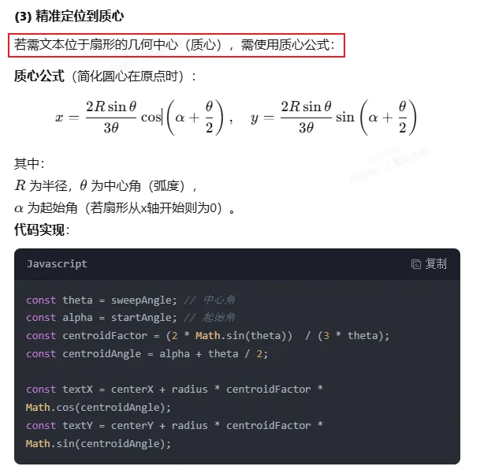

# lotteryTurntable

- NOTE
  - canvas
    - ctx.save()和ctx.restore()，在绘制图形过程中，平移、旋转、绘制文本，会影响之前画布的内容；所以在平移、旋转、绘制文本之前save，在平移、旋转、绘制文本之后restore。保证画布之前的内容不受到影响。+
    - ctx.arc(centerX,  centerY, radius, startAngle, endAngle);绘制扇形
    - canvas没有提供事件机制，那么我得怎么实现在画布上的点击效果
      - 方案一：用一个div定位到画布上指定位置。由div标签提供事件机制
      - 方案二：在canvas标签上监听事件，在画布上某个位置点击，获取坐标，碰撞检测，触发响应操作。
  - 数学
    - 2Π表示完整的圆的弧度
    - 求扇形的几何中心（质心公式）
        - 
        - centroidFator(质心因子)、centroidAngle（质心角度）
